# 智能合约开发及其部署

## 是什么?
[智能合约（Smart Contract）](https://baike.baidu.com/item/%E6%99%BA%E8%83%BD%E5%90%88%E7%BA%A6)概念于1995年由尼克·萨博（Nick Szabo）首次提出，他给出的定义是如下：
::: tip 智能合约
一个智能合约是一套以数字形式定义的承诺（commitment），包括合约参与方可以在上面执行这些承诺的协议。
:::
智能合约是一种旨在以信息化方式传播、验证或执行合同的计算机协议，它允许在没有第三方的情况下进行可信交易，这些交易可追踪且不可逆转。通俗直白的讲，智能合约就是一个较为智能的合同或约定，能按照事先约定好的条件，进行自我执行和验证。举个简单的栗子:
  * 我们都听过这样的一种游戏，叫一元夺宝。为什么叫听过呢？因为我们没有见到过有谁真正的用1元幸运的中了一个手机。最终谁中了我们也不知道。但是如果我们采用了智能合约来玩这个游戏，规则就是每个人都向合约地址发送1个代币的资产，然后合约在接收资产达到相应的数量的时候，就自动执行抽奖逻辑，最终合约将游戏资产发送给中奖的地址。在这个过程中，合约的代码是公开的，每个人都能够看到合约执行的逻辑；其次，参与人数是公开的，有多少人什么时间参与游戏是清楚的；最后，中奖的地址是公开的，谁中奖了什么时候中奖了中了多少奖都是公开透明的且不可篡改的。

对于当前所讲的编写和部署的智能合约，我简单的理解就是：运行在分布式网络中的一套代码，其运行规则和逻辑在部署的一刻已经进行了规定，并且后续的运行不受其他无关因素的影响。当然这仅仅是作者本人的一面之词，具体的专业的智能合约的讲解请移步至搜索引擎查询。接下来我们讨论一下，如何通过[EOS](https://baike.baidu.com/item/EOS/20441174)来部署一个[Todolist智能合约](https://github.com/qianduanxinlv/vuepress_blog/tree/master/docs/dapp/contract/yijiaxunkeji)。关于为什么选择EOS作为部署智能合约本文不做阐述，只关注如何编写和部署。

## 怎么做?
### 1.智能合约的开发
一个EOS智能合约有以下几部分组成：C++代码、ABI文件以及基于C++代码而编译的WASM文件。C++代码里面可以分为两种，即包含合约功能的CPP源文件和包含CPP文件所引用的变量、常量、函数的HPP头文件。ABI文件就是应用二进制接口(Application Binary Interface)文件，是一个基于JSON的描述文件，是关于转换JSON和二进制格式的用户actions的。ABI还描述了如何将数据库状态和JSON的互相转换。一旦您通过ABI描述了您的合约，开发者和用户就能够用JSON和您的合约无缝交互。整个逻辑是这样：

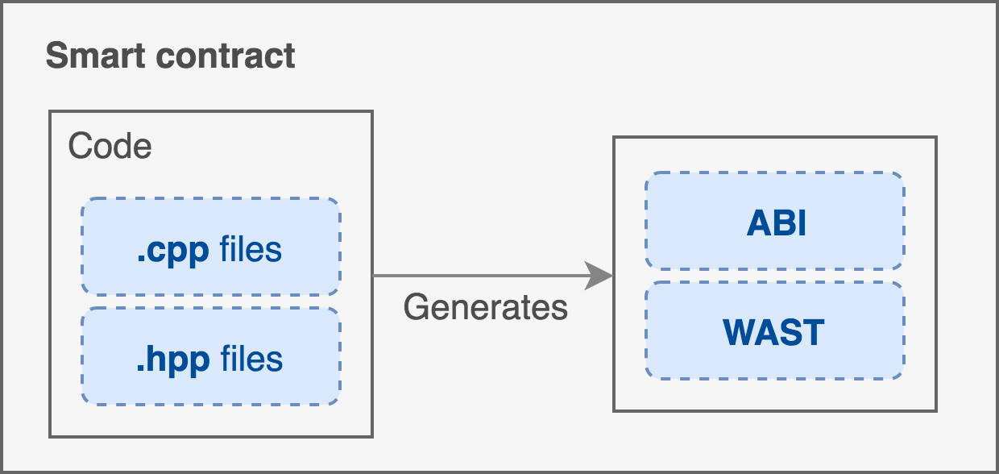
图片来自[https://github.com/eosasia/ping-eos](https://github.com/eosasia/ping-eos)项目，想学习智能合约开发的同学可以关注。

由图片可知，ABI文件和WAST文件都是由C++文件生成的，生成的方式可以查看官方仓库[eosio.cdt](https://github.com/EOSIO/eosio.cdt)。

#### Todolist智能合约
当前Todolist智能合约初步设定有增加事项、完成事项、删除事项三个基础功能，同时使用multi_index表设计了todotable数据表，每条数据包含了当前事项的id、事项内容以及是否完成三个字段。具体合约代码如下：

<!-- <<< ./yijiaxunkeji/yijiaxunkeji.cpp -->

一个简单的todolist智能合约代码就编写完成了，至于HPP头文件此处可以不需要，另外ABI文和WASM文件已经生成，可以在[Todolist智能合约](https://github.com/qianduanxinlv/vuepress_blog/tree/master/docs/dapp/contract/yijiaxunkeji)获取到。接下来我们主要讲解一下如何将其部署到EOS的[Kylin测试链](https://kylin.eosx.io/#/blocks)上。

### 2.智能合约的部署
智能合约部署是通过搭建EOS链的环境来部署的，由于这个过程漫长且兼具挑战性，所以对于初学者我们还是通过网页IDE来部署的。当前使用过的网页版的有[EOS Studio](https://www.eosstudio.io/)、[dev4eos](https://dev4eos.com/#/)、[链安Beosin-IDE](https://beosin.com/BEOSIN-IDE/index.html#/)，其中符合我的使用习惯的是链安开发的这个。故此次部署是通过Beosin-IDE实现的。
* 导入[Todolist智能合约](https://github.com/qianduanxinlv/vuepress_blog/tree/master/docs/dapp/contract/yijiaxunkeji)里面的文件（因为使用的是yijiaxunkeji这个EOS账号部署的，所以文件名和合约名都命名为yijiaxunkeji，如果你是其他的EOS账号，需要都更改为你的账户名），结果如下：

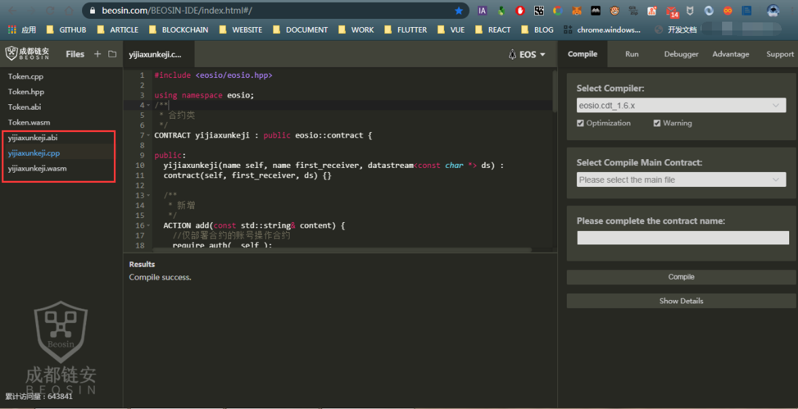

* 检查和编译合约
  * 点击右上Compile标签
  * Select Compile Main Contract处点击后选择你自己的合约文件即当前的yijiaxunkeji.cpp
  * 点击Compile按钮
  * 查看Results里面是否为Compile success，Compile不成功也就是代码写错了则会在右下角提示错误。

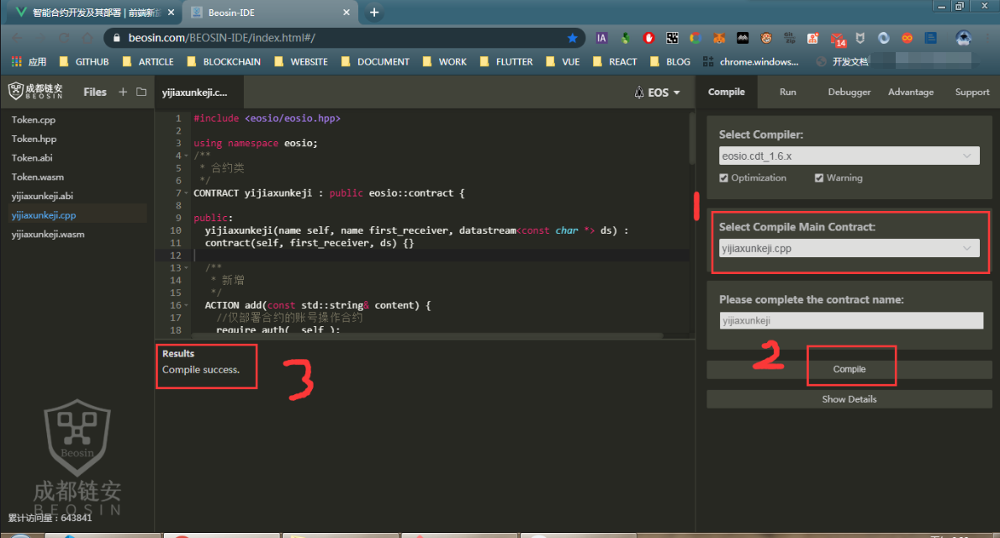

* 运行和部署合约
  * 点击右上Run标签
  * 初步选择Local network网络
  * 选择部署合约的账号（自动生成5个账号），选择其中一个
  * 点击Deploy按钮
  * 查看Run log list:里面是否为 Set contract success.并且右下角会出现当前合约的actions也就是声明的函数等等。
  * 此时合约已经部署到本地的网络了。至此我们可以和智能合约进行简单的操作。

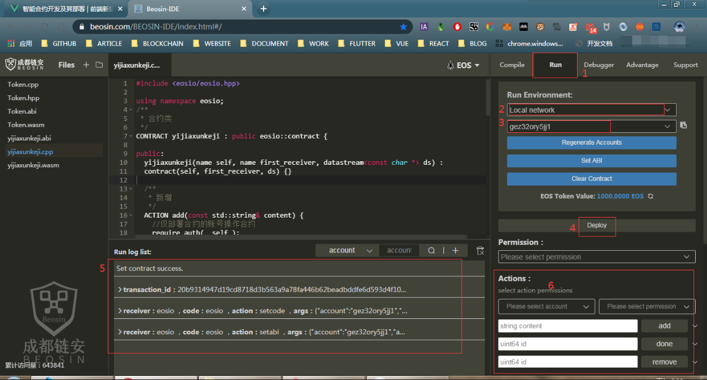

* 智能合约交互
  * Actions处选择部署的智能合约的账号，以及合约的权限，当前合约的此处可随意选择。
  * 在add方法前面写入待办事项，然后点击add后，就会返回当前操作的交易哈希即transaction_id，包含了当前交互的信息。
  * Tables处选择合约里面创建的todotable表，然后点击Inquire，就能查看到当前的数据。此时可以看到我们增加了一条数据。
  * 如果我们选择Actions的时候，选的是其他账户，那么操作就会被拒绝，因为我们在合约中写入了 require_auth(_self)，代表只有当前部署的账户才能操作。
  * 同样done和remove函数也是一样，输入id就可以和合约交互

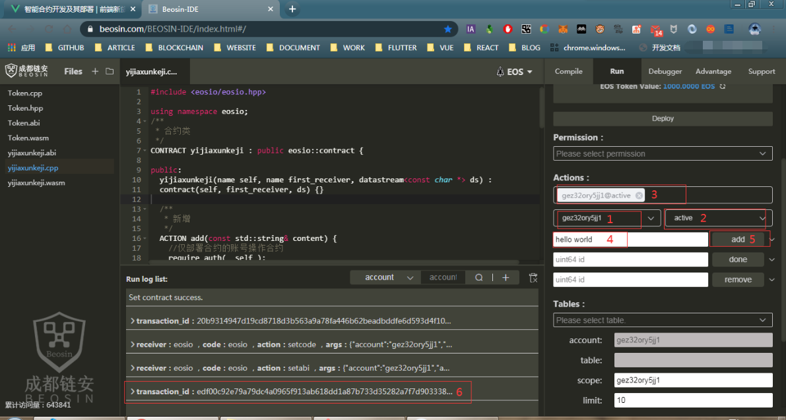
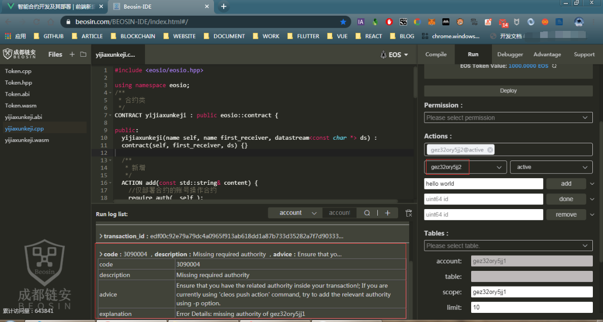

* 以上是在本地网络部署的，所有的交易仅能本地看到，所以我们需要将其部署到测试网络或者是EOS主网上面。下面我们将通过Math Wallet 钱包插件部署合约到EOS麒麟测试网，关于钱包的创建和麦子钱包插件的使用可参考[这篇文章](hh)
  * 点击右上Run标签
  * 选择Test network网络，此时会弹出Math钱包插件，选择CryptoKylin TestNet，点击Switch network.

  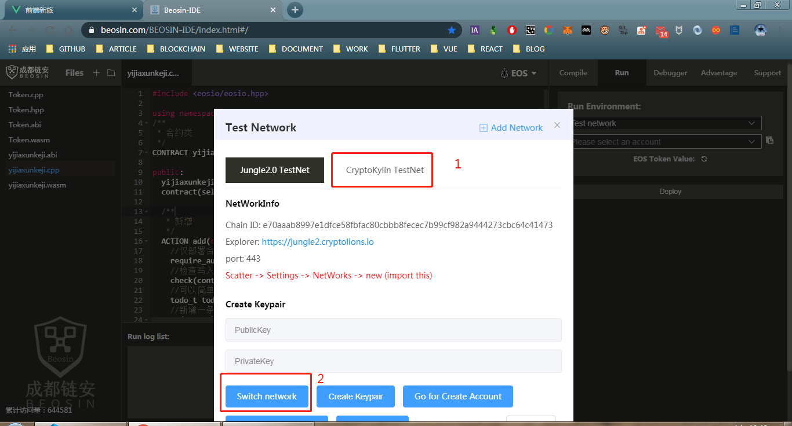

  * 切换网络后就会弹出选项让选择登陆的账户，此时选择要部署合约的账户即可。登陆后可以看到当前账户的余额。

  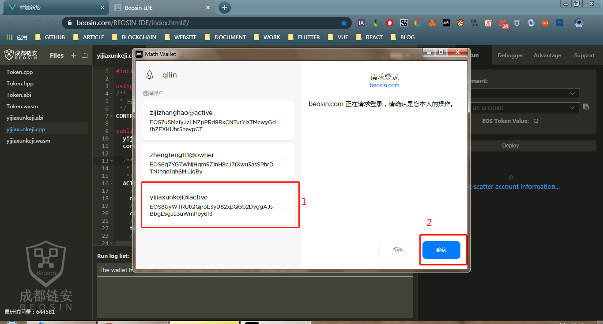
  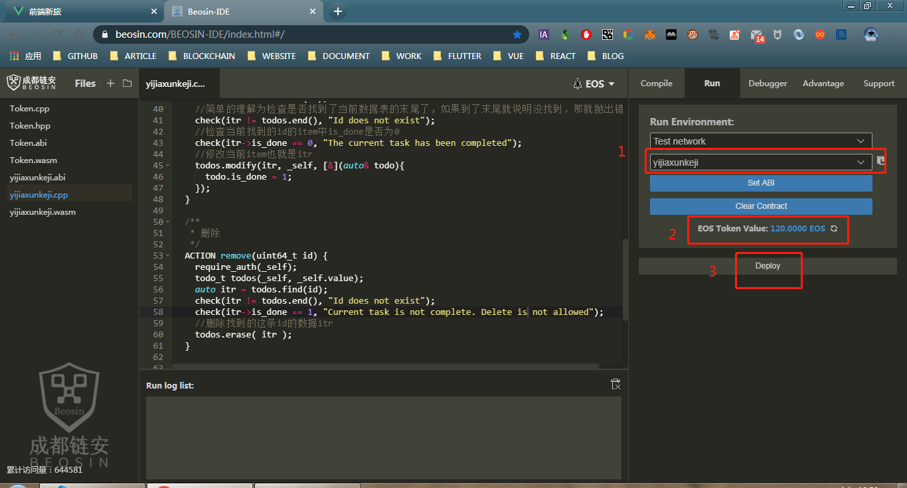

  * 点击Deploy按钮，此时弹出请求签名的弹框，点击确认就能够看到wasm文件部署成功了。

  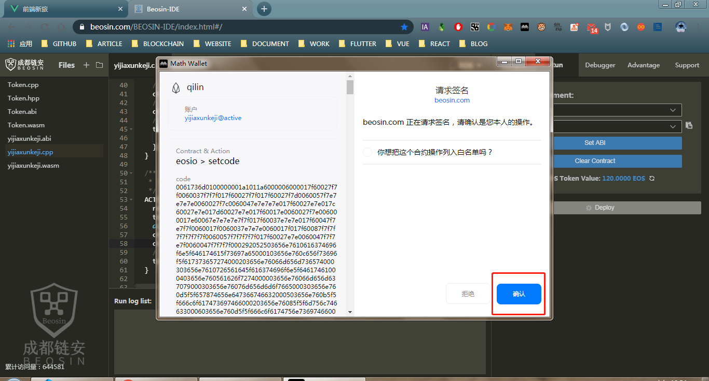
  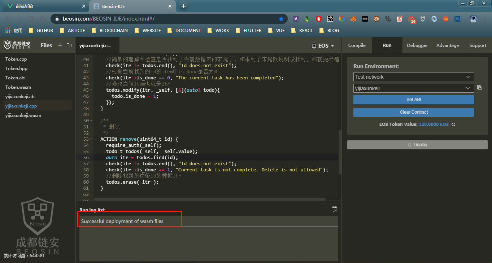

  * 之后会自动弹出另一个请求部署abi文件的请求签名弹框，同样点击确认就可以了。不出意外会出现 Successful deployment of abi files，并且右下角会出现当前合约的actions

  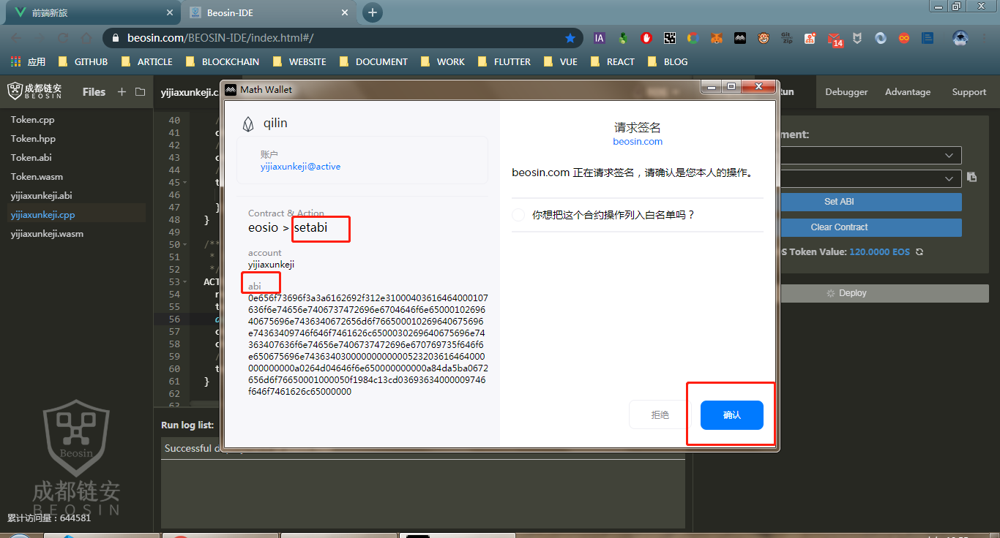
  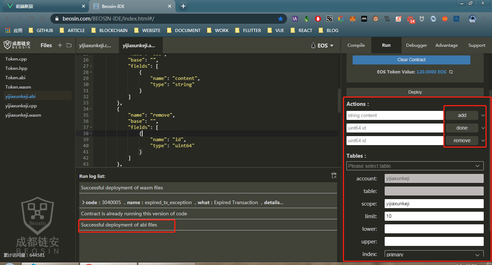

  * 此时我们可以在add方法里输入待办事项，然后点击add按钮，弹出签名请求框后，对action进行签名后就能够在log里面看到当前交易的信息了。 

  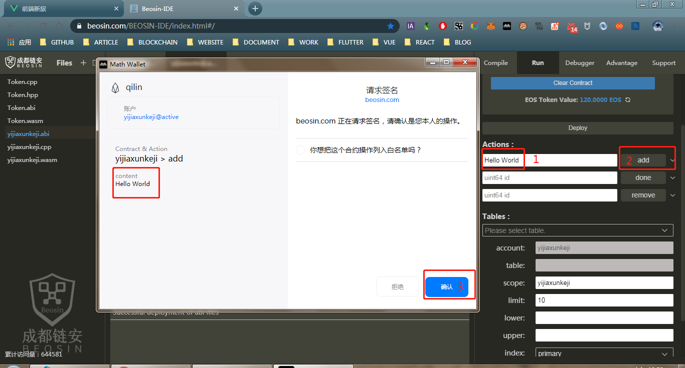

  * Tables里选择todotable表，然后点击Inquire后，就能够看到当前数据表中已经增加了一条数据。同样done和remove也是一样。

  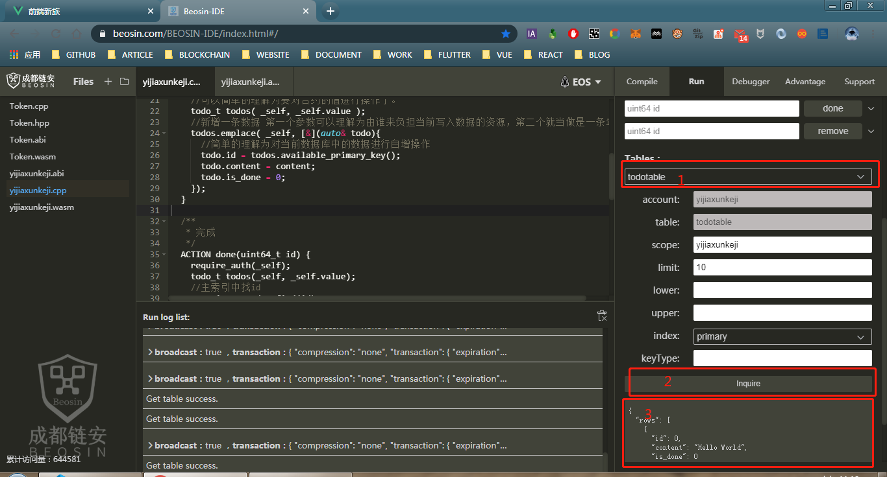

  ::: tip 提示
  EOS的交易等都需要对交易进行签名，所以每次操作都要弹出签名请求，此时可以将当前合约账号添加到白名单，这样每次就不需要弹窗然后自动签名了。
  :::

注： 图片太小看不清楚的话，可以访问[部署合约步骤图片地址](https://github.com/qianduanxinlv/vuepress_blog/tree/master/docs/dapp/contract/images)

以上便是EOS开发和部署智能合约的简易流程，更专业更可靠的流程请前往[EOSIO](https://github.com/EOSIO)。当然对于普通用户来讲，通过直接调用合约方法和查询表的方式有难度，所以我们需要将当前合约和网页或者是APP结合在一起，通过可视化的操作来同合约交互。那么接下来我们讲一下，如何通过前端页面和yijiaxunkeji账户部署的智能合约进行交互。