# 去中心化存储
::: tip 提醒
以下关于去中心化存储及其相关的理解为作者本人粗浅的理解，如需更加专业的讲解请移步至搜索引擎手动查询，谢谢！
:::
[[toc]]

## 是什么?
去中心化存储简单通俗的讲就是将数据存储在去中心化的设备上，这种设备可以是手机、电脑、硬盘、或者是服务器等等可用于存储的设备。没有一个实体的确切的组织或机构可以对存储的文件等进行删除、修改，只有固定权限的人员才能进行相应的文件操作。对于权限的操作进行管理的系统就是去中心化存储系统，这种系统可以使得任何人将自己的文件数据存储到系统的某些节点，而不必担心数据被删改或非法使用和访问等。

## 怎么做?
要将文件存储到去中心化的设备上，我们需要处理的问题有很多。比如凭什么能让别人使用自己的设备来存储你的文件？如何保证你存储的文件不被他人所利用或删改？好在当前有部分较为成熟的去中心化存储方案让我们可以进行去中心化的存储，其中[IPFS(星际文件系统)](https://baike.baidu.com/item/%E6%98%9F%E9%99%85%E6%96%87%E4%BB%B6%E7%B3%BB%E7%BB%9F/22695381)使得我们去中心化的存储变得简单很多。那么，我们怎么使用这个系统来进行去中心化存储呢？接下来，我将详细的介绍如何通过IPFS来进行去中心化的存储。

### 1.配置IPFS环境并搭建本地节点
 * 点击[IPFS](https://dist.ipfs.io/#go-ipfs)，选择相应的文件进行下载。如果国内无法打开，可以[clone](https://github.com/xiangzhengfeng/ipfs-package)该项目，但仅支持Window 64位的电脑。
 * 下载完解压后，执行 install.sh 进行安装。如果无法执行，可以手动添加ipfs路径到环境变量中。

 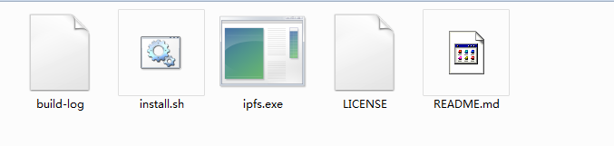
 * 启动命令行，输入 ipfs -h，如果配置好了就会出现下面的命令提示

 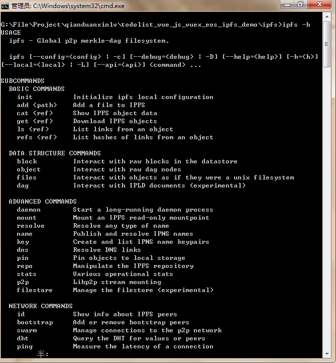
 * 输入 ipfs init 进行初始化

 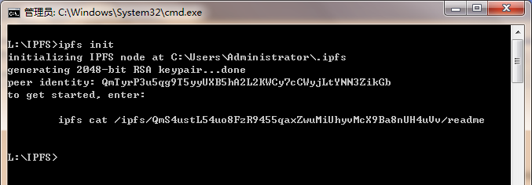
 * 初始化后，输入 ipfs id 即可查看当前节点信息

 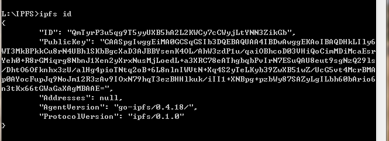
 * 输入 ipfs daemon 就可以启动本地节点了

 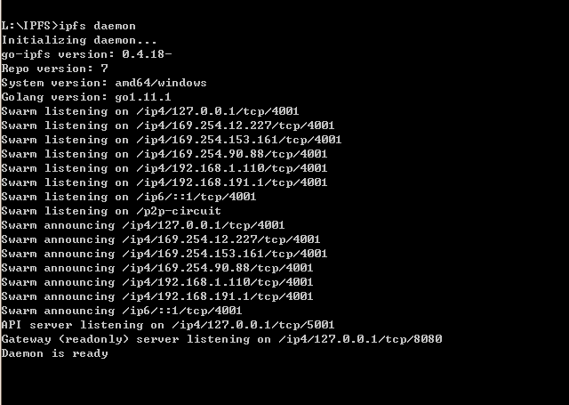
 * 接下来打开浏览器，访问 [localhost:5001/webui](localhost:5001/webui)，就可以看到web页面了。

 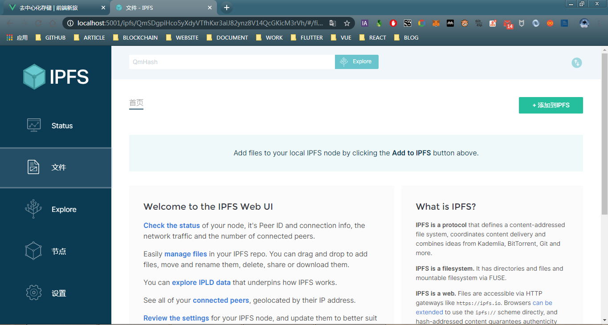

### 2.上传文件和访问文件
 * 此时我们可以通过web UI界面添加文件到IPFS网络

 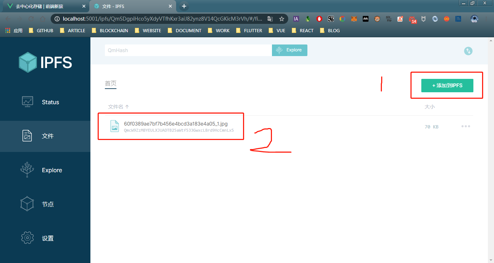
 * 刚才添加了一张图片，现在复制哈希值，将其添加到 localhost:8080/ipfs/ 之后，就能够看到刚才添加的图片了。

 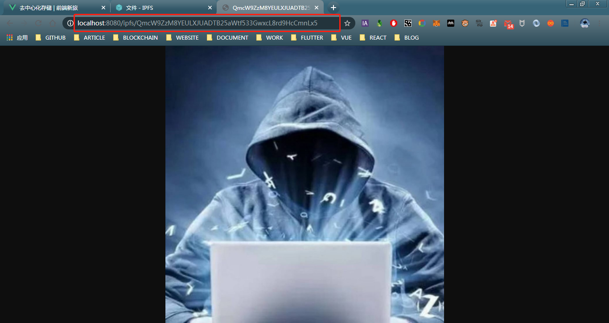
 * 通过命令行，使用 ipfs add 文件，也可以添加文件到网络中。QmYC4**********************seFk，这种字符就是该文件的哈希，全网有且只有这一个，任何地方访问该哈希都可以看到这个文件。

 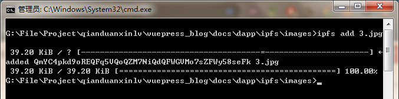
 * 刚才命令行添加了一张图片，现在复制哈希值，将其添加到 localhost:8080/ipfs/ 之后，就能够看到刚才命令行添加的图片了。

 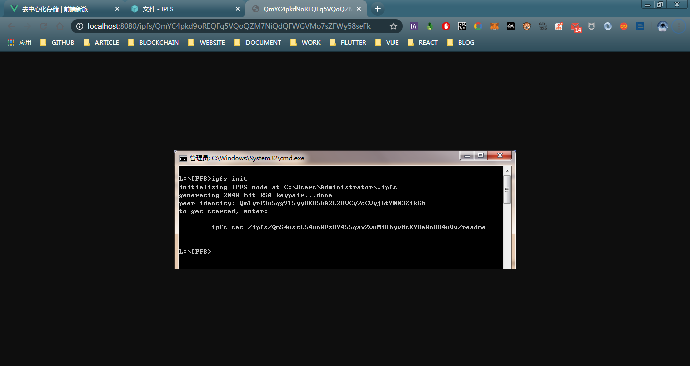
 * 不仅仅可以传图片，视频、音乐都行，甚至html文件都行，所以我们的去中心化应用访问的前端就部署在这里面就可以访问了。以下是其他网友在IPFS上传的视频。因为网络的缘故可能无法打开。不过其他大神开源的这个[IPFS播放器](http://www.ipfs.guide/v/QmYVri7jyBdPyfR8AgBLTgyTjiJifCgpeHFiFrKxowQeq8)可以播放IPFS的视频。
 ```
    神秘巨星：QmWBbKvLhVnkryKG6F5YdkcnoVahwD7Qi3CeJeZgM6Tq68
    芳华：QmYVri7jyBdPyfR8AgBLTgyTjiJifCgpeHFiFrKxowQeq8
    大佛普拉斯：QmdpR9iP9EhUg1rmduHqwA4ddyHNMcsR8t9saXA9BmMU4t
    看不见的客人：QmYWwXkgjdhMps9mB6DyEp4zSFmDQ9U6SuqGRGovEycr49
    勇往直前：QmZRJevYhADpXmCGGF6eCcP1afNEYFahDW5jxje3iyyCJS
    至暗时刻：QmUPvs7iyM5ZWPQwDovRqvNzxMJHSUWNRWAWRkAsseVcvs
    银翼杀手2049：QmcUHdzKgRrcJrD5Ah46HgBHF7urWDhmAnLKYwcHaLgeGP
    盗梦空间：QmQATmpxXvSiQgt9c9idz9k3S3gQnh7wYj4DbdMQ9VGyLh
    狮子王：QmfHGQZNQNymHDC6b7TZjgGbh962VWQQN5oV92w9jHE4qt
    祖宗十九代：QmbrwEH4AEQhUN929yPy4j5B2PfQYk3JJyG8iq7HVoXbia
    疯狂动物城：QmUKaQwN2ppapUEFhbHsKoVXn2yBRM7mLpu5HQv9am7dB7
    彩绘心天地：QmXg1c6qPtoQAyfrXrWnuDrUgFehnt4kLvv1hxheMUeFBC
    肖申克的救赎：QmRUYeMkvirV4frGX8wcntCq6x5GqDixAjZnFj5Jg1E3qj
    太空旅客：QmdxpUVnvFnert9nmEkzwwz2tWdavU3fUQzrgBsTZP5yyG
```
 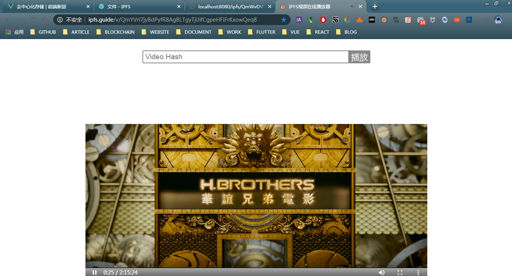

### 3.上传Todolist DAPP包
为了减少同学们的麻烦，我将IPFS和todolist项目进行了整合，只需按照下面的步骤就可以部署项目了。
* clone [todolist](https://github.com/xiangzhengfeng/todolist/tree/master/vue_js_vuex_eos_ipfs)项目
* yarn 或 npm run install
* yarn serve 或 npm run serve 启动本地服务，查看前端页面。
* yarn build 或 npm run build 打包项目，此时在ipfs目录里面会有一个dist文件夹，里面就是todolist打包后的包。一般我们是将包给运维让其部署到服务器上面，此时我们自己来将其部署到IPFS网络中。
* yarn daemon 或 npm run daemon 启动ipfs本地节点服务
* yarn deploy 或 npm run deploy 部署项目到ipfs网络中，红色选中部分就是dist文件的根目录的哈希值

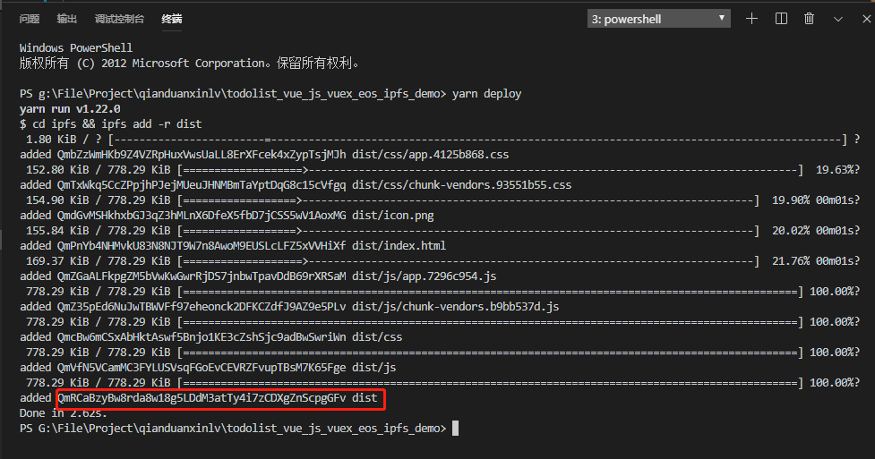
 * 此时我们访问 localhost:8080/ipfs/hash 就能打开看到我们的前端页面了。

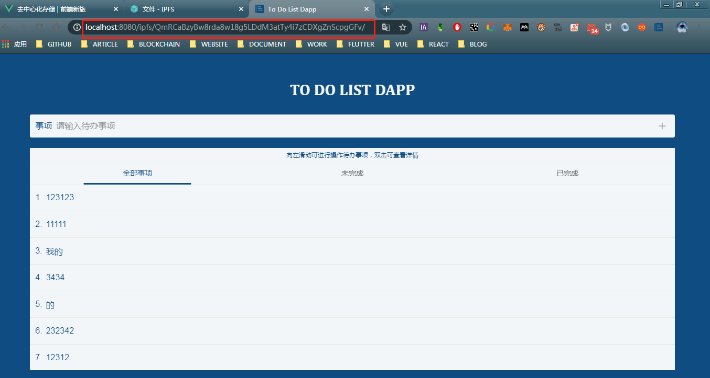

到此，我们可以说已经完成了TodoList DAPP的全部内容，已经能够去实现一个简单的初级的去中心化应用了。应用运行的逻辑代码是公开的，智能合约部署在EOS区块链上面，前端页面部署在IPFS网络中。如果采用社区运作和管理，那么相对于大多数的应用来讲，已经非常去中心化了。