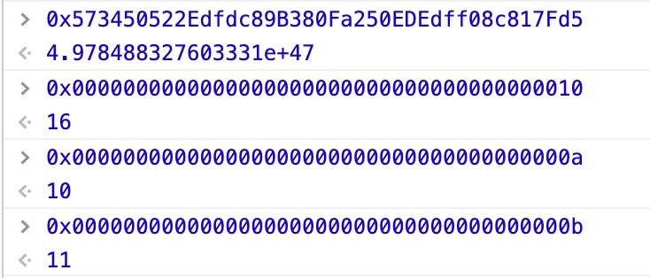

[UniswapV2Factory](https://github.com/Uniswap/uniswap-v2-core/blob/master/contracts/UniswapV2Factory.sol)是一个继承了[IUniswapV2Factory](https://github.com/Uniswap/uniswap-v2-core/blob/master/contracts/interfaces/IUniswapV2Factory.sol)接口的智能合约，该合约是一个工厂合约，可以通过该合约创建交易对合约。

## UniswapV2Factory源码
<<< @/dapp/uniswap/v2/source-code/contracts/core/UniswapV2Factory.sol

## UniswapV2Factory源码解析

### 1. 手续费变量
```sol
address public feeTo;
address public feeToSetter;
```
* feeTo: 这个状态变量主要是用来切换开发团队手续费开关。在UniswapV2中，用户在交易代币时，会被收取交易额的千分之三的手续费分配给所有流动性供给者。如果feeTo不为零地址，则代表开关打开，此时会在手续费中分1/6给开发团队。feeTo设置为零地址（默认值），则开关关闭，不从流动性供给者中分走1/6手续费。它的访问权限设置为public后编译器会默认构建一个同名public函数，正好用来实现IUniswapV2Factory.sol中定义的相关接口。
* feeToSetter: 这个状态变量是用来记录谁是feeTo设置者。其读取权限设置为public的主要目的同上。

### 2. 交易对变量
```sol
mapping(address => mapping(address => address)) public getPair;
address[] public allPairs;
```
* getPair: 这个状态变量是一个map(其key为地址类型，其value也是一个map)，它用来记录所有的交易对地址。注意，它的名称为getPair并且为public的，这样的目的也是让默认构建的同名函数来实现相应的接口。注意这行代码中出现了三个address，前两个分别为交易对中两种ERC20代币合约的地址，最后一个是交易对合约本身的地址。这种两个map组成的public的map。生成的同名函数调用的时候，使用的是 fn(map1key, map2key)，即getPair(address, address)这种调用。
* allPairs: 记录所有交易对地址的数组。虽然交易对址前面已经使用map记录了，但map无法遍历。如果想遍历和索引，必须使用数组。注意它的名称和权限，同样是为了实现接口

### 3. createPair函数
```sol
function createPair(address tokenA, address tokenB) external returns (address pair) {
  require(tokenA != tokenB, 'UniswapV2: IDENTICAL_ADDRESSES');
  (address token0, address token1) = tokenA < tokenB ? (tokenA, tokenB) : (tokenB, tokenA);
  require(token0 != address(0), 'UniswapV2: ZERO_ADDRESS');
  require(getPair[token0][token1] == address(0), 'UniswapV2: PAIR_EXISTS'); // single check is sufficient
  bytes memory bytecode = type(UniswapV2Pair).creationCode;
  bytes32 salt = keccak256(abi.encodePacked(token0, token1));
  assembly {
    pair := create2(0, add(bytecode, 32), mload(bytecode), salt)
  }
  IUniswapV2Pair(pair).initialize(token0, token1);
  getPair[token0][token1] = pair;
  getPair[token1][token0] = pair; // populate mapping in the reverse direction
  allPairs.push(pair);
  emit PairCreated(token0, token1, pair, allPairs.length);
}
```
createPair该函数顾名思义，是用来创建交易对。

该函数接受任意两个代币地址为参数，用来创建一个新的交易对合约并返回新合约的地址。注意，它的可见性为external并且没有任何限定，意味着合约外部的任何账号（或者合约）都可以调用该函数来创建一个新的ERC20/ERC20交易对（前提是该ERC20/ERC20交易对并未创建）。

该函数前四行主要是用来进行参数验证，并且同时将代币地址从小到大排序。
* 第1行用来验证两种代币的合约地址不能相同，也就交易对必须是两种不同的ERC20代币。
* 第2行用来对两种代币的合约地址从小到大排序，因为地址类型底层其实是uint160，所以也是有大小可以排序的。
* 第3行用来验证两个地址不能为零地址。为什么只验证了token0呢，因为token1比它大，它不为零地址，token1肯定也就不为零地址。
* 第4行用来验证交易对并未创建（不能重复创建相同的交易对）。
> 关于地址类型底层其实是uint160，可以看以下浏览器计算便能理解:
<center></center>

该函数第5-10行用来创建交易对合约并初始化。
* 第5行用来获取交易对模板合约UniswapV2Pair的创建字节码creationCode。注意，它返回的结果是包含了创建字节码的字节数组，类型为bytes。类似的，还有运行时的字节码runtimeCode。creationCode主要用来在内嵌汇编中自定义合约创建流程，特别是应用于create2操作码中，这里create2是相对于create操作码来讲的。注意该值无法在合约本身或者继承合约中获取，因为这样会导致自循环引用。
* 第6行用来计算一个salt。注意，它使用了两个代币地址作为计算源，这就意味着，对于任意交易对，该salt是固定值并且可以线下计算出来。
* 第7行中的assembly代表这是一段内嵌汇编代码，Solidity中内嵌汇编语言为Yul语言。在Yul中，使用同名的内置函数来代替直接使用操作码，这样更易读。后面的左括号代表内嵌汇编作用域开始。
* 第8行在Yul代码中使用了create2函数（该函数名表明使用了create2操作码）来创建新合约。它接受四个参数，分别是v, p, n, s。它适用于Constantinople版本，也就是从君士坦丁堡版本开始可用，使用该函数时注意对应的以太坊版本。四个参数其中v代表发送到新合约的eth数量（以wei为单位），p代表代码的起始内存地址，n代表代码的长度，s代表salt。
* 第9行是内嵌汇编作用域结束。
* 第10行是调用新创建的交易对合约的一个初始化方法，将排序后的代币地址传递过去。为什么要这样做呢，因为使用create2函数创建合约时无法提供构造器参数。

该函数的第11-14行用来记录新创建的交易对地址并触发交易对创建事件。
* 第11行和第12行用来将交易对地址记录到map中去。因为：1、A/B交易对同时也是B/A交易对；2、但在查询交易对时，用户提供的两个代币地址并没有排序，所以需要记录两次。
* 第13行将交易对地址记录到数组中去，便于合约外部索引和遍历。
* 第14行触发交易对创建事件。

### 4. setFeeTo函数
```sol
function setFeeTo(address _feeTo) external {
  require(msg.sender == feeToSetter, 'UniswapV2: FORBIDDEN');
  feeTo = _feeTo;
}

function setFeeToSetter(address _feeToSetter) external {
  require(msg.sender == feeToSetter, 'UniswapV2: FORBIDDEN');
  feeToSetter = _feeToSetter;
}
```
setFeeTo用来设置新的feeTo以切换开发团队手续费开关（可以为开发团队接收手续费的地址，也可以为零地址）。注意，该函数首先使用require函数验证了调用者必须为feeTo的设置者feeToSetter，如果不是则会重置整个交易。

setFeeToSetter函数用来转让feeToSetter。它首先判定调用者必须是原feeToSetter，否则重置整个交易。

但这里有可能存在这么一种情况：当原feeToSetter不小心输错了新的设置者地址_feeToSetter时，设置会立即生效，此时feeToSetter为一个错误的或者陌生的无控制权的地址，无法再通过该函数设置回来。虽然UniswapV2团队不会存在这种疏忽，但是我们自己在使用时，还是有可能发生的。有一种方法可以解决这个问题，就是使用一个中间地址值过渡一下，而新的feeToSetter必须再调用一个接受方法才能真正成为设置者。如果在接受之前发现设置错误，原设置者可以重新设置。具体代码实现可以参考下面的Owned合约的owner转让实现：
```sol
pragma solidity ^0.4.24;
contract Owned {
  address public owner;
  address public newOwner;

  event OwnershipTransferred(address indexed _from, address indexed _to);

  constructor() public {
      owner = msg.sender;
  }

  modifier onlyOwner {
      require(msg.sender == owner,"invalid operation");
      _;
  }

  function transferOwnership(address _newOwner) public onlyOwner {
      newOwner = _newOwner;
  }
  function acceptOwnership() public {
      require(msg.sender == newOwner,"invalid operation");
      emit OwnershipTransferred(owner, newOwner);
      owner = newOwner;
      newOwner = address(0);
  }
}
```

## create2函数知识点拓展。

这里我们先稍微提一下以太坊虚拟机中账号的内存管理。每个账号（包含合约）都有一个内存区域，该内存区域是线性的并且在字节等级上寻址，但是读取限定为256位（32字节）大小，写的时候可以为8位（1字节）或者256位（32字节）大小。

Solidity中内嵌汇编访问本地变量时，如果本地变量是值类型，直接使用该值 ；如果本地变量是引用类型（对内存或者calldata的引用），那么会使用它在内存或者calldata中的地址，而不是值本身。在Solidity中,bytes为动态大小的字节数组，它不是值类型而是引用类型。类似的string也是引用类型。

注意到create2函数调用时使用了类型信息creationCode，结合上面的知识拓展，从该函数代码中我们可以得到：

bytecode为内存中包含创建字节码的字节数组，它的类型为bytes，是引用类型。根据上述提到的内存读取限制和内嵌汇编访问本地引用类型的变量的规则，它在内嵌汇编中的实际值为该字节数组的内存地址。函数中首先读取了该内存地址起始的256位（32字节）,它存储了creationCode的长度，具体的获取方法为mload(bytecode)。
内存中creationCode的实际内容的起始地址为add(bytecode, 32)。为什么会在bytecode上加32呢？因为刚才提到从bytecode开始的32字节存储的是creationCode的长度，从第二个32字节开始才是存的实际creationCode内容。
create2函数解释中的p对应代码中的add(bytecode, 32)，解释中的n对应为mload(bytecode)。
其实以太坊中这样的方式很常见，比如某函数调用的参数为数组时（calldata类型），参数部分编码后，首先第一个单元（32字节）记录的是数组长度，接下来才是数组元素，每个元素（值类型）一个单元（32字节）。

因为使用内嵌汇编会增加阅读难度，所以在Solidity0.6.2版本以后，提供了新语法来实现create2函数的功能，直接在语言级别上支持使用salt创建合约。参见下面示例代码中的合约d的创建过程：
```sol
pragma solidity >0.6.1 <0.7.0;

contract D {
    uint public x;
    constructor(uint a) public {
        x = a;
    }
}

contract C {
    function createDSalted(bytes32 salt, uint arg) public {
        /// This complicated expression just tells you how the address
        /// can be pre-computed. It is just there for illustration.
        /// You actually only need ``new D{salt: salt}(arg)``.
        address predictedAddress = address(bytes20(keccak256(abi.encodePacked(
            byte(0xff),
            address(this),
            salt,
            keccak256(abi.encodePacked(
                type(D).creationCode,
                arg
            ))
        ))));

        D d = new D{salt: salt}(arg);
        require(address(d) == predictedAddress);
    }
}
```
该代码中通过直接在new的D合约类型后面加上salt选项的方式进行自定义的合约创建，等效使用Yul中的create2函数。注意该示例中predictedAddress的计算方法和create2函数解释中的地址计算方法是一致的。

注意，使用示例中的语法创建新合约还可以提供构造器参数，并不存在create2函数中无法使用构造器参数的问题，因此它也移除了新合约初始化函数的部分需求（初始化在构建器中进行）。但是UniswapV2指定了Solidity的编译器版本为0.5.16，所以无法使用该语法。如果我们自己要使用，需要将编译器版本指定为0.6.2以上，同时需要注意Solidity0.6.2以上的具体某个版本和0.5.16版本有哪些不同并加以修改。

## 引用及知识拓展
* [充分利用 CREATE2](https://ethfans.org/posts/getting-the-most-out-of-create2)
* [CREATE2 在广义状态通道中的使用](https://learnblockchain.cn/2019/10/23/create2-statechannel/)
* [CREATE2](https://ctf-wiki.org/blockchain/ethereum/attacks/create2/)
* [Solidity原理（三）：abi编码以及与EVM交互的原理](https://blog.csdn.net/Programmer_CJC/article/details/80190058?utm_medium=distribute.pc_relevant.none-task-blog-2%7Edefault%7EBlogCommendFromMachineLearnPai2%7Edefault-1.control&depth_1-utm_source=distribute.pc_relevant.none-task-blog-2%7Edefault%7EBlogCommendFromMachineLearnPai2%7Edefault-1.control)
* [solidity学习过程 --- abi编码](https://blog.csdn.net/qq_35434814/article/details/104682616)